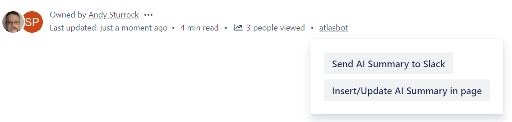
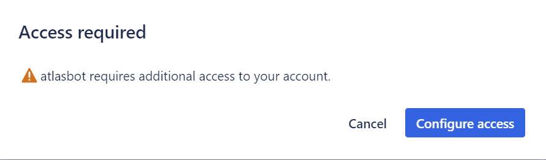
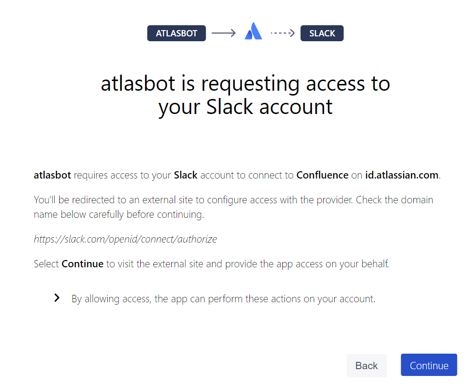
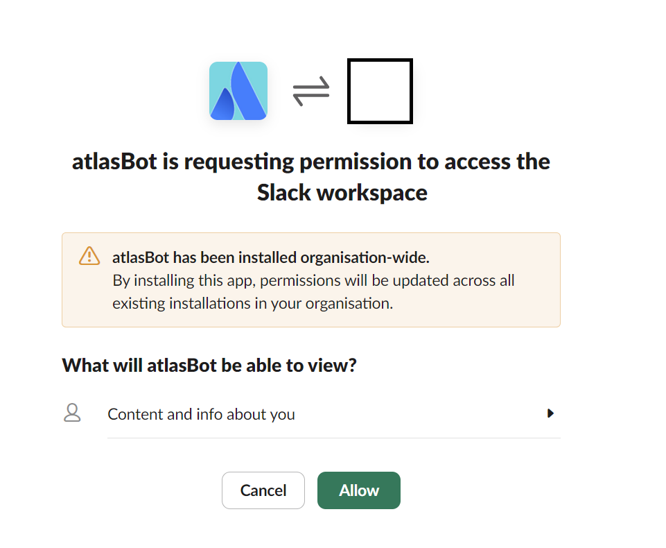

# atlasBot
Atlassian utilities via a Forge app and Slack bot

## Functionality
atlasBot provides a [Confluence content byline item](https://developer.atlassian.com/platform/forge/manifest-reference/modules/confluence-content-byline-item/) with two items in the dropdown menu, as below.

On first time use the user is prompted to connect their Slack account to Confluence:

Once the Slack account has been connected the menu item is executed as follows:
1. If the Slack option is chosen the Slack app will DM the user with the summary of the Confluence page.
2. If the insert summary in page option is chosen a "tl;dr" section is added to the top of the page followed by a horizonal divider.  Any existing tl;dr section is updated.